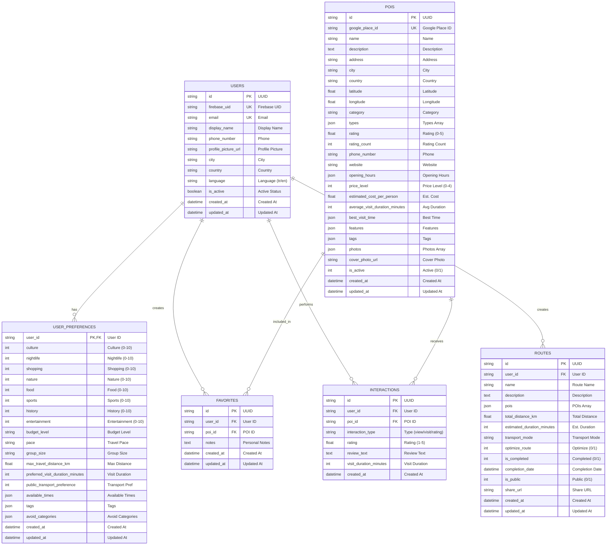

# RouteWise Database ER Diagram

## Veritabanı Şeması



## Tablo İlişkileri

### 1. USERS (Ana Tablo)
- **Primary Key**: id (UUID)
- **Unique Keys**: firebase_uid, email
- **İlişkiler**:
  - 1:1 → USER_PREFERENCES (bir kullanıcının bir tercih kaydı)
  - 1:N → FAVORITES (bir kullanıcının birden fazla favorisi)
  - 1:N → INTERACTIONS (bir kullanıcının birden fazla etkileşimi)
  - 1:N → ROUTES (bir kullanıcının birden fazla rotası)

### 2. USER_PREFERENCES
- **Primary Key**: user_id (aynı zamanda Foreign Key)
- **İlişki**: 1:1 → USERS
- **Amaç**: Kullanıcı tercihlerini saklar (kategoriler, bütçe, tempo vb.)

### 3. POIS (Point of Interest - Mekanlar)
- **Primary Key**: id (UUID)
- **Unique Keys**: google_place_id, foursquare_id
- **İlişkiler**:
  - 1:N → FAVORITES (bir POI birden fazla kullanıcı tarafından favorilere eklenebilir)
  - 1:N → INTERACTIONS (bir POI ile birden fazla etkileşim olabilir)
- **Amaç**: Ziyaret edilebilecek mekan bilgilerini saklar

### 4. FAVORITES (Favoriler)
- **Primary Key**: id (UUID)
- **Foreign Keys**: user_id, poi_id
- **İlişki**: Many-to-Many bridge table (USERS ↔ POIS)
- **Cascade**: User veya POI silindiğinde otomatik silinir
- **Amaç**: Kullanıcıların favori mekanlarını saklar

### 5. INTERACTIONS (Etkileşimler)
- **Primary Key**: id (UUID)
- **Foreign Keys**: user_id, poi_id
- **İlişki**: Many-to-Many bridge table (USERS ↔ POIS)
- **Cascade**: User veya POI silindiğinde otomatik silinir
- **Amaç**: Kullanıcı-mekan etkileşimlerini takip eder (görüntüleme, değerlendirme, yorum vb.)

### 6. ROUTES (Rotalar)
- **Primary Key**: id (UUID)
- **Foreign Key**: user_id
- **İlişki**: N:1 → USERS
- **Cascade**: User silindiğinde otomatik silinir
- **Amaç**: Kullanıcıların oluşturduğu seyahat rotalarını saklar

## Kategori Değerleri

### POI Kategorileri
- `culture` - Kültür (müzeler, galeriler)
- `nightlife` - Gece Hayatı (barlar, kulüpler)
- `shopping` - Alışveriş (çarşılar, AVM'ler)
- `nature` - Doğa (parklar, plajlar)
- `food` - Yemek (restoranlar, kafeler)
- `sports` - Spor (fitness, aktiviteler)
- `history` - Tarih (tarihi yerler, anıtlar)
- `entertainment` - Eğlence (sinema, konser)

### Etkileşim Tipleri
- `view` - Görüntüleme
- `click` - Tıklama
- `visit` - Ziyaret
- `rating` - Değerlendirme
- `review` - Yorum
- `share` - Paylaşım
- `route_added` - Rotaya Ekleme

## İndeksler

### USERS
- `firebase_uid` (UNIQUE INDEX)
- `email` (UNIQUE INDEX)

### POIS
- `google_place_id` (UNIQUE INDEX)
- `name` (INDEX)
- `city` (INDEX)
- `country` (INDEX)
- `latitude` (INDEX)
- `longitude` (INDEX)
- `category` (INDEX)

### FAVORITES
- `user_id` (INDEX)
- `poi_id` (INDEX)

### INTERACTIONS
- `user_id` (INDEX)
- `poi_id` (INDEX)
- `interaction_type` (INDEX)
- `created_at` (INDEX)

### ROUTES
- `user_id` (INDEX)

## Cascade Delete Davranışları

| Ebeveyn Tablo | Çocuk Tablo | Davranış |
|---------------|-------------|----------|
| USERS | USER_PREFERENCES | CASCADE DELETE |
| USERS | FAVORITES | CASCADE DELETE |
| USERS | INTERACTIONS | CASCADE DELETE |
| USERS | ROUTES | CASCADE DELETE |
| POIS | FAVORITES | CASCADE DELETE |
| POIS | INTERACTIONS | CASCADE DELETE |

## JSON Alan Yapıları

### POIS.opening_hours
```json
{
  "monday": {"open": "09:00", "close": "18:00"},
  "tuesday": {"open": "09:00", "close": "18:00"},
  ...
}
```

### USER_PREFERENCES.available_times
```json
{
  "monday": {
    "morning": true,
    "afternoon": true,
    "evening": false
  },
  ...
}
```

### ROUTES.pois
```json
[
  {"poi_id": "uuid-1", "order": 1},
  {"poi_id": "uuid-2", "order": 2},
  ...
]
```
